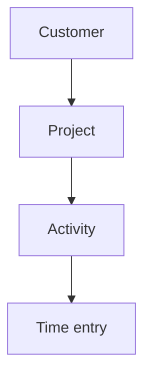
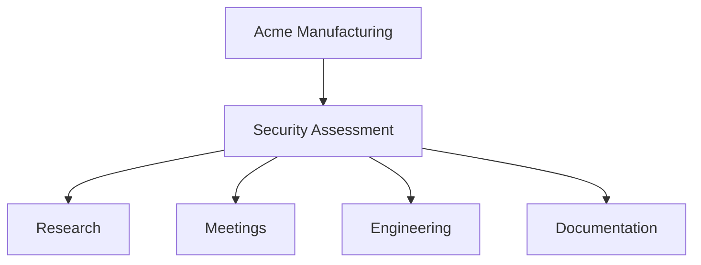
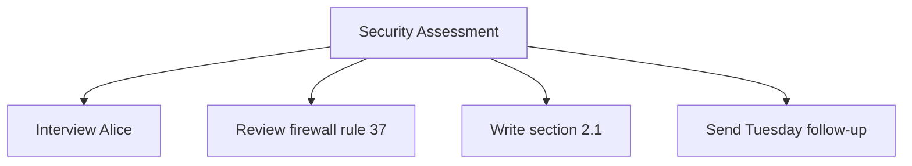
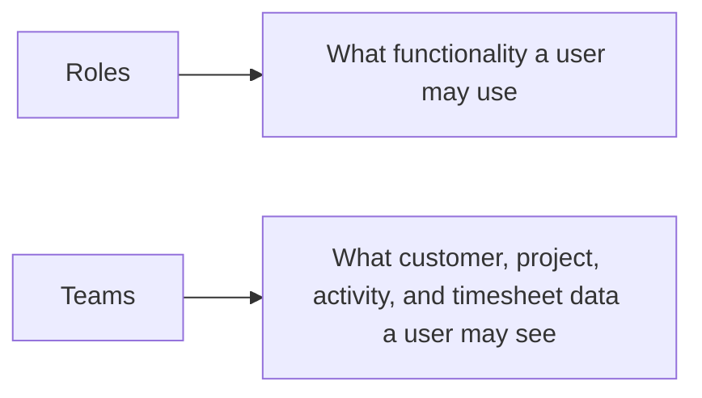
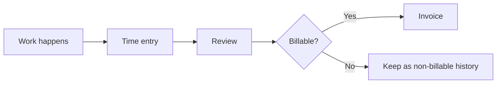

# How Kimai thinks about your work

Kimai becomes much easier to understand once you stop thinking about its menus and start thinking about its data model.

## The core hierarchy

Every time record is organized around this structure:

A **project** belongs to one customer.  A time entry is assigned to a project and an activity, which means its customer is known through the project.  The time entry also belongs to exactly one user.

An **activity** can be tied to a specific project or can be global and available across projects.

This hierarchy is not merely organizational decoration.  Kimai uses it for reporting, invoicing, visibility, rates, and other behavior.  The official [Initial setup](https://www.kimai.org/documentation/initial-setup.html) documentation therefore recommends thinking about the structure before entering large amounts of real data.

## A plain-language translation

For a consulting business, a useful starting interpretation is:

| Kimai concept | Think of it as | Fictional example |
| --- | --- | --- |
| Customer | Who the work is for | Acme Manufacturing |
| Project | The engagement, contract, retainer, or meaningful body of work | Security Assessment |
| Activity | The kind of work being performed | Research |
| Time entry | A particular period of work | 1.5 hours of research |

That is a starting model, not a universal rule.  An internal team may model its own company as the customer, an initiative as the project, and types of work as activities.

## Activities are categories, not to-do items

One common source of confusion is the word "activity."  In Kimai, activities are useful as categories of work.  The official setup guidance explicitly advises against creating one activity for every task.

For example, this is usually easier to maintain:

than this:

Task-level distinctions can be handled separately when they are actually needed.  We will cover activities, tags, and task management in more depth later.

## Users are another dimension

The hierarchy above answers **what work was performed and for whom**.  The user attached to a time entry answers **who performed it**.

That distinction becomes important for permissions, rates, reports, and invoices.

## Roles and teams solve different problems

These two concepts are easy to confuse:

Kimai's [Roles & Permissions](https://www.kimai.org/documentation/permissions.html) documentation describes roles as the mechanism controlling access to functionality.  Its [Teams](https://www.kimai.org/documentation/teams.html) documentation describes teams as the mechanism for restricting access to data.

A small installation where everyone may see the same customers and projects may not need teams at all.

## Where invoices fit

An invoice is not another level between activity and time entry.  Time is recorded first.  Kimai can later select eligible time records and use their customer, project, activity, rate, and other information when producing invoices.

For now, the important lesson is that choices made when modeling and recording work eventually affect billing.  That is why the next step is to plan a small structure before entering real data.
