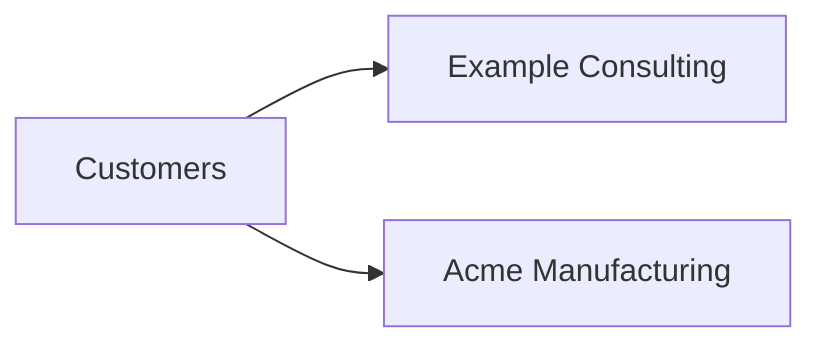
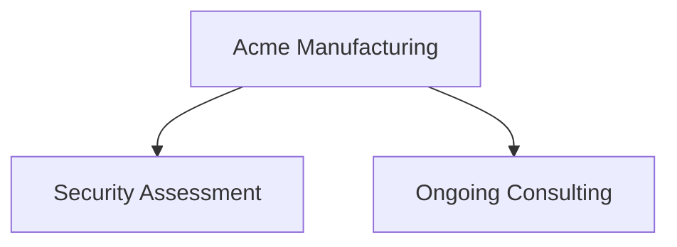
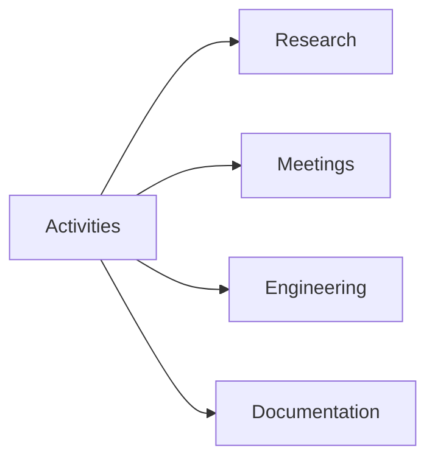
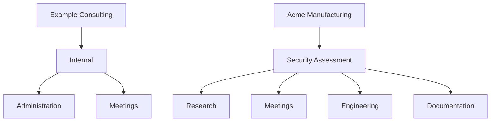

# Plan your setup

Before creating real data, sketch the smallest structure that describes the work you actually do.

Kimai gives you considerable freedom, but freedom is not the same as needing complexity.  The official [Initial setup](https://www.kimai.org/documentation/initial-setup.html) guidance recommends starting with a small number of entries because it is easier to add another project later than to clean up a structure that grew without a plan.

## Start with customers

A customer answers the question: **who is this work for?**

For an external consulting or service business, a customer will usually be the client organization.  Separate engagements for the same organization usually do not require separate customers.

Kimai also recommends creating a customer representing your own organization.  That gives internal work such as administration or meetings a proper home, and the organization can later be used as the invoice issuer.

A small fictional starting point might be:

## Use projects for meaningful bodies of work

A project answers: **what engagement or body of work is this part of?**

For Acme Manufacturing, you might eventually have:

Avoid creating a new project merely because a new week or billing month began unless the business relationship genuinely works that way.  Reporting and invoicing are more useful when project boundaries correspond to something meaningful outside Kimai.

Kimai project start and end dates affect whether a project is available for time entry, so dates should reflect real boundaries when you use them.

## Keep activities reusable and understandable

An activity answers: **what kind of work was performed?**

A useful small vocabulary might be:

Kimai supports both project-specific and global activities.  Global activities are useful for kinds of work that recur across projects.  The current Kimai setup documentation also notes an important asymmetry: a project-specific activity can be converted to a global activity, while a global activity cannot simply be converted the other way around.  Kimai therefore suggests starting global when you are unsure.

Do not create one activity for every individual task.  Activities work best as categories.

## Add tags only when they answer another question

Tags can provide another dimension when customer, project, and activity do not express something you genuinely need to filter or report on.

For example, a future tag might distinguish `onsite` from `remote`, or identify a sprint or workstream.  If you cannot yet say what decision or report a tag will support, you probably do not need it during initial setup.

## Do not design teams before you have a visibility problem

Roles and teams are not prerequisites for building the customer/project/activity structure.

If every user may see every customer and project, the official Kimai setup guidance says teams can be skipped.  Introduce them when you have a concrete requirement such as one department being unable to see another department's customers.

This is especially worth postponing because assigning a team changes visibility: Kimai documents unassigned objects as broadly visible, while assigning a team restricts them to that team's members and team leads, subject to elevated permissions.

## Sketch first, click second

Before entering anything in Kimai, write down a candidate structure like this:

Then ask:

- Does each customer represent a real organization or internal entity I care about?
- Does each project represent a meaningful body of work?
- Would an activity name make sense across many individual time entries?
- Am I adding something only because Kimai offers a field for it?
- Can I keep the first version smaller?

## Preserve history once real time exists

The current Kimai setup documentation warns against deleting customers, projects, or activities after they have been used because deletion also removes linked time records.  It recommends making used objects invisible instead so they disappear from normal selections while historical records remain.

That suggests a useful operating principle for the rest of this guide: once an object participates in real time or billing history, prefer lifecycle changes that preserve history over destructive cleanup.

## Next

Once the structure is understandable, the practical loop is to record time, review it, and eventually turn eligible time into an invoice.  Continue with [Using Kimai](../using-kimai/index.md) for that workflow.
