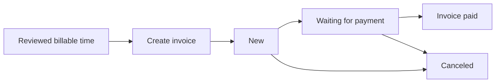
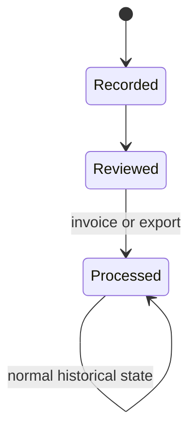
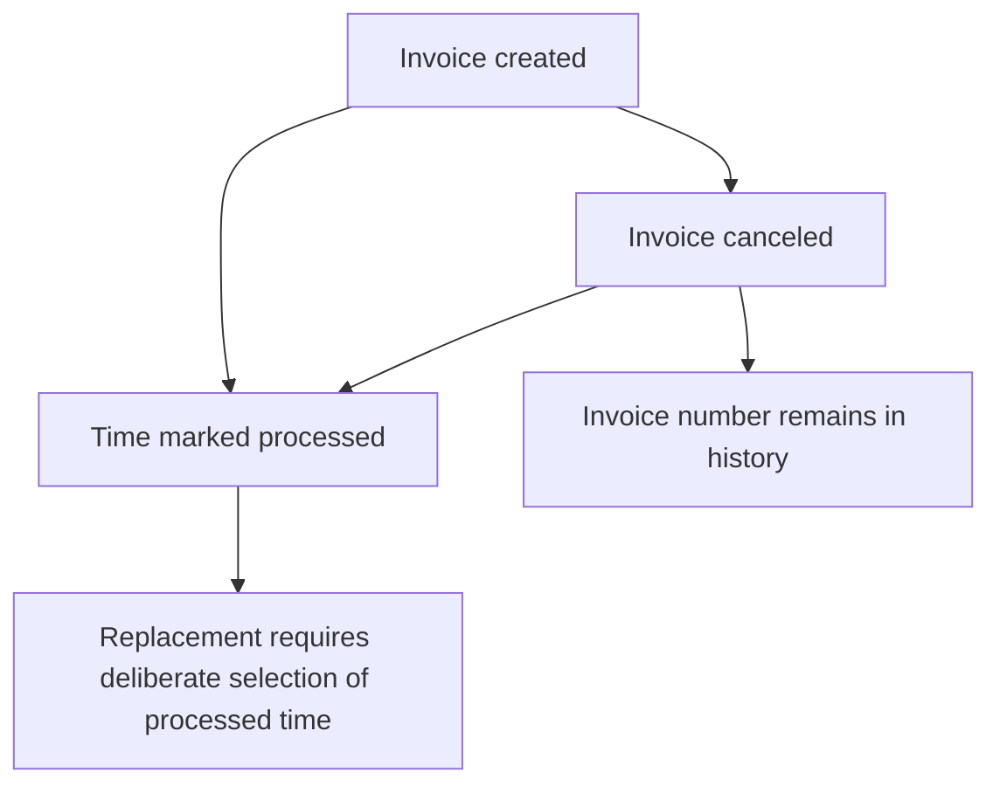

# Create and manage invoices

Kimai creates invoices from recorded, billable time.  For a newcomer, the most useful way to think about invoice creation is as the point where reviewed time becomes processed billing history.

## Prepare invoicing once

Before creating a real invoice, make sure the administrative pieces exist.

### Create your own organization as a customer

Kimai uses a customer record as the **invoice issuer**.  That record represents the organization sending the invoice.  Fill in the company and address information you expect to appear on invoices.

This is separate from the customer receiving the invoice.

### Check the receiving customer

The customer's currency is used for time-entry prices and invoices.  Kimai's invoice module operates on one customer at a time, which also avoids combining multiple customer currencies into one invoice.

Check the customer's company name, address, contact information, currency, and other invoice-relevant fields before generating a real document.

### Create an invoice template

Open **Invoices > Templates** and create an invoice template.  An invoice template is not merely visual styling; it also carries billing behavior and metadata.

For a basic first template, pay attention to:

- internal template name;
- invoice title;
- invoice issuer;
- terms of payment;
- contact and bank/payment text when applicable;
- tax rate;
- payment term in days;
- language;
- invoice-number generator;
- document template/renderer;
- grouping of invoice lines.

Kimai can associate a default invoice template with a customer, which makes repeated billing less error-prone after you have validated the template.

## Review the time before opening the invoice flow

Do not use invoice creation as the place where you discover incorrect time records.  Complete the [pre-invoice review](review-time.md) first.

Only billable items are included in invoices.  If time is unexpectedly absent, check its date range, customer/project/activity classification, billable state, and whether it was already exported or invoiced.

## Create the invoice through the web interface

Open **Invoices** and begin creating a new invoice.  The creation flow is driven by the set of records you want to bill.

For a typical customer invoice:

1. Select the customer receiving the invoice.
2. Select the intended billing period.
3. Narrow the selection by project or other available filters when you do not want every eligible entry in that period.
4. Select or confirm the invoice template.
5. Review the resulting invoice items, grouping, hours/amounts, tax, and total.
6. Create the invoice only when the result matches the reviewed source time.

The exact fields shown can vary with configuration and installed Kimai version, but the underlying rule is stable: the invoice is built from the eligible records selected by the invoice query, and only billable items qualify.

## What creation changes

Creating an invoice is a meaningful state transition for the time records involved.

Kimai uses the export flag to mark those records as processed.  Processed records are excluded by default from future invoice/export selections and regular users cannot edit them.

That behavior helps prevent the same ordinary time from being casually invoiced twice, but it is also why mistakes should be caught before invoice creation.

## Understand invoice states

Kimai currently defines these invoice states:

| State | Meaning |
| --- | --- |
| New | The invoice was created |
| Waiting for payment | The invoice was sent to the customer |
| Invoice paid | Payment was received; Kimai requires a payment date |
| Canceled | The invoice was invalidated or needs replacement |

The state is useful operational history.  A freshly generated invoice does not become "paid" merely because the document exists.

## Prefer cancellation over deletion

Kimai explicitly warns against deleting invoices.  Depending on the invoice-number format, deletion can interfere with counters and may allow a future invoice number to collide with one that was already used.

For an invoice that should no longer be valid, prefer **Canceled**.  The canceled invoice remains in history and retains its invoice number.

This is one of the places where preserving history is more important than making the screen look tidy.

## Cancellation does not make the original time ordinary again

There is an important subtlety here.

Canceling an invoice does **not** reset the export flag on the timesheets that were processed when the invoice was created.  Kimai also documents that it does not retain a direct list of which items belonged to a canceled invoice for purposes of automatically rebuilding it.

If you need to create a replacement invoice using the same time, you may need to include already-exported records in the relevant filtering process and carefully reconstruct the intended set.

For that reason, cancellation is safer than deletion for invoice history, but cancellation is not an "undo" button for the underlying time records.

## A first-invoice rehearsal

Before creating the first real customer invoice, a useful rehearsal is:

1. Create a few disposable test time entries for a test or internal context.
2. Confirm their rates and billable state.
3. Generate an invoice using the intended template.
4. Inspect the generated document carefully.
5. Confirm the invoice appears in **Invoice history**.
6. Confirm the source time is now treated as processed.

Be deliberate about invoice numbers while testing.  Once real invoice numbering begins, treat generated invoices as accounting history and prefer cancellation over deletion.  The official initial-setup page suggests deleting a test invoice, while the current invoice reference warns generally against deletion because of numbering consequences; this guide follows the more conservative rule once production numbering matters.

## After sending and payment

When you actually send the invoice, move it to **Waiting for payment** if that state matches your workflow.  When payment arrives, mark it **Invoice paid** and record the payment date.

The **Invoice history** view can then be filtered by creation date, customer, and state, giving you a lightweight view of the invoice lifecycle.

## Official reference

See Kimai's [Invoices](https://www.kimai.org/documentation/invoices.html), [Customer](https://www.kimai.org/documentation/customer.html), and [Initial setup](https://www.kimai.org/documentation/initial-setup.html) documentation for the authoritative product behavior.
