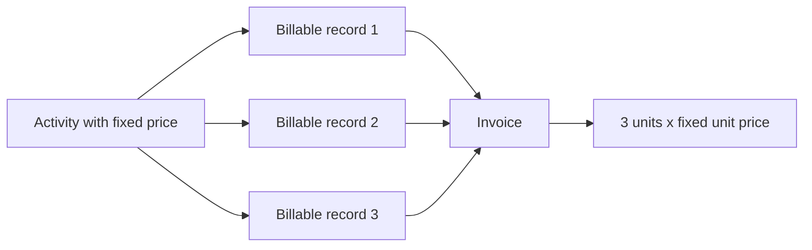
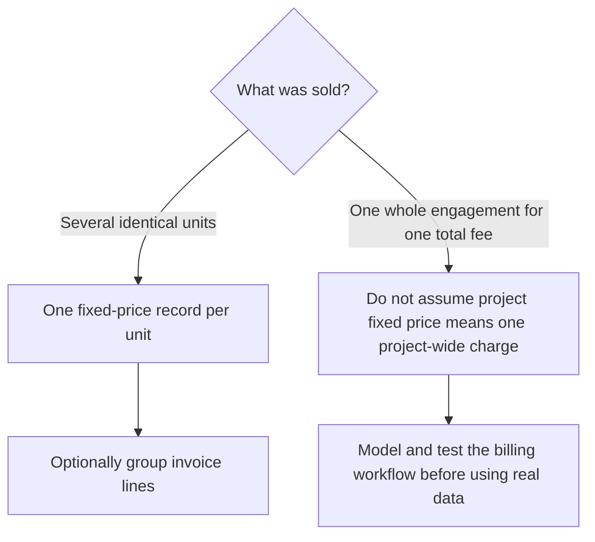

# Bill fixed-price fees and quantities

Kimai is built around time records, but a time record does not have to be billed by the hour.  A customer can instead be charged a **fixed price** for each record, regardless of how long that record lasted.

That makes fixed pricing useful for work such as a review, report, assessment, installation, or other repeatable unit that has an agreed price.

The important mental model is:



## Fixed price means per record

In Kimai, a fixed price is not an arbitrary invoice adjustment.  It is a pricing rule for a timesheet record.

With hourly pricing, Kimai calculates the external price from the duration and hourly price.  With fixed pricing, the configured fixed price becomes the price of the record regardless of its duration.  Kimai's pricing rules also give a fixed price precedence over an hourly price when both are available.

This distinction is especially important when thinking about quantity: **one fixed-price timesheet record represents one fixed-price unit**.

For example, suppose a customer buys three identical assessments at **$250 each**.  The intended billing is:

| Quantity | Unit price | Total |
| ---: | ---: | ---: |
| 3 | $250 | $750 |

In stock Kimai, you can represent that as three billable records using an activity whose fixed price is $250.

## Configure the fixed price

For a repeatable fixed-price item, the activity level is often the clearest place to put the price because the activity describes the type of work being billed.

For example:

- Customer: **Acme Manufacturing**
- Project: **Security Services**
- Activity: **Security Assessment**
- Fixed price: **$250**

Open **Activities**, select the activity, and open its detail page.  In the **Prices** section, add a price rule.

For a basic catch-all fixed price:

1. Leave **User** empty unless this price should apply only to one particular user.
2. Enter the per-unit amount in **Price** -- for example, `250`.
3. Enable **Fixed price**.
4. Set **Internal price** only if you also need a fixed internal cost for the item.
5. Save the price rule.

Kimai documents activity pricing as more specific than project, customer, or user fallback pricing, so an applicable activity price normally wins over less-specific rules.

!!! note "Price changes do not rewrite old records"
    Kimai stores the calculated price with a timesheet record when the record is saved.  Changing the activity price later affects new or deliberately recalculated records; it does not silently rewrite historical prices.

## Record the quantity

A normal Kimai timesheet form does **not** contain a general-purpose quantity field for billing three units at once.

To represent three fixed-price units in stock Kimai, create three billable timesheet records using the fixed-price activity.

For example:

| Record | Activity | Description | Fixed price |
| --- | --- | --- | ---: |
| 1 | Security Assessment | Assessment - Site A | $250 |
| 2 | Security Assessment | Assessment - Site B | $250 |
| 3 | Security Assessment | Assessment - Site C | $250 |

The recorded durations can still describe the real time spent on each item.  The duration remains useful for time reporting and internal analysis, but the customer-facing price of each record is $250 because the pricing rule is fixed.

Do not invent fake durations merely to make the invoice total work.  The fixed-price rule is what determines the external price.

After saving the records, review them under **My times** or **All times** and confirm that each record shows the expected price before invoicing.

## Show the three records as one invoice line

Kimai invoice templates have a **Grouping of invoice lines** setting.  When you want several matching fixed-price records to appear as a summarized line, grouping by **Activity** is a useful choice.

Kimai's activity invoice calculator groups records by activity and pricing type.  Fixed-price records with the same activity and fixed price can therefore be merged into one invoice item.  Each fixed-price record contributes one unit to the grouped amount.

For the example above, the conceptual result is:

```text
Security Assessment        3 x $250.00        $750.00
```

The exact visual layout depends on the selected invoice document/template, but the underlying grouped invoice item carries the accumulated amount, unit price information, and total.

If you instead choose an invoice grouping that keeps individual timesheet records separate, expect three separate $250 invoice lines rather than one quantity-three line.  Neither result changes the $750 total.

!!! tip "Preview the result before using it with a customer"
    Invoice presentation depends on both the grouping calculator and the invoice document/template.  Create disposable test records first and verify that your chosen template displays the grouped fixed-price item the way you expect.

## When the fixed price belongs somewhere else

Activity-level fixed pricing is convenient for repeatable units, but Kimai can also define fixed-price rules on customers and projects.

Use the narrowest level that expresses the business rule cleanly:

- **Customer fixed price** -- useful when essentially every applicable record for that customer carries the same fixed fee.
- **Project fixed price** -- useful when records within one engagement carry the same fixed fee.
- **Activity fixed price** -- useful when a particular type of work is sold at a repeatable unit price.

Because activity pricing is more specific than project and customer pricing, avoid piling fixed-price rules onto several levels unless you intentionally want the more specific rule to override the broader one.

## Fixed price is not the same as "one project costs $750"

There are two different ideas that can sound like "fixed price":

1. **$250 each for three billable units** -- three fixed-price records at $250 each are a natural representation.
2. **The entire project costs $750 regardless of how many time records exist** -- assigning a $750 fixed price to the project does **not** mean "invoice this project once for $750."  It means each matching timesheet record can receive a $750 fixed price.

That second distinction can prevent an expensive mistake.  Kimai's fixed-price mechanism operates per record; it is not automatically a one-time project fee.



## When this model is a poor fit

This approach works best when a billable unit can reasonably be represented as a Kimai record.

Stock Kimai remains a time-tracking system whose invoices are built from billable records.  If your business primarily needs arbitrary product lines such as "Quantity 37, SKU ABC, unit price $12.95" without corresponding work records, forcing those products into timesheets can make the data model misleading.

For this guide, the recommendation is to use fixed-price timesheet records for genuine fixed-fee work units and to avoid disguising unrelated product inventory as time records merely to obtain a quantity field.

## Before invoicing

For fixed-price records, the pre-invoice review should answer four questions:

1. Is there exactly one billable record for each unit that should be charged?
2. Does each record have the intended fixed price?
3. Are the records assigned to the correct customer, project, and activity?
4. Does the invoice template's line grouping produce the presentation you want?

Then continue with [Review time before billing](review-time.md) and [Create and manage invoices](create-invoice.md).

## Official reference

See Kimai's [Prices (rates)](https://www.kimai.org/documentation/rates.html), [Activities](https://www.kimai.org/documentation/activity.html), [Invoices](https://www.kimai.org/documentation/invoices.html), and [Invoice templates](https://www.kimai.org/documentation/invoice-templates.html) documentation for the authoritative product behavior.
