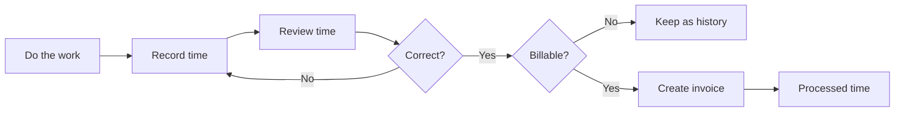

# Using Kimai

Once customers, projects, and activities exist, Kimai becomes a repeating workflow rather than a collection of administration screens.

For a small service business, that loop is the heart of the system.  Customer, project, activity, rate, role, and team configuration all exist partly to make that loop produce useful records.

## The important habit

Review time **before** invoicing it.

Kimai uses the same export flag for invoice and export processing.  Once time records are processed, they are excluded by default from future invoices and regular users cannot edit them.  That makes the review step more important than it might appear at first.

The next three pages walk through the operational flow:

1. [Record time](record-time.md)
2. [Review time before billing](review-time.md)
3. [Create and manage invoices](create-invoice.md)

The official [Timesheet](https://www.kimai.org/documentation/timesheet.html) and [Invoices](https://www.kimai.org/documentation/invoices.html) pages remain the reference for all available fields and permissions.  The pages here focus on what a newcomer needs to understand in order to use those screens safely.
