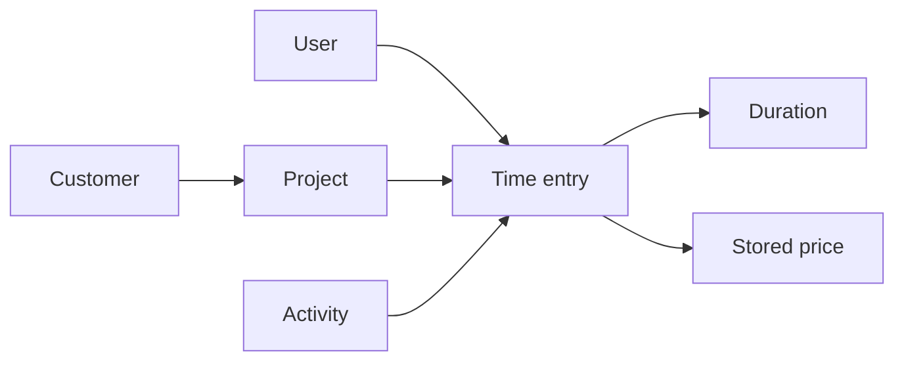
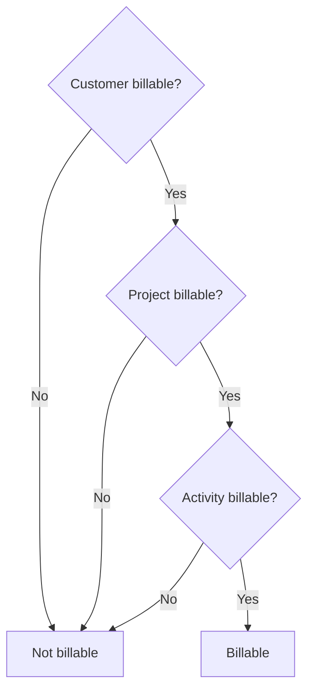

# Record time

A time entry is Kimai's record that a particular user performed a particular kind of work for a particular project during a particular period.

The customer is determined through the project, so a normal entry ultimately connects all of these ideas:

## Before you record real time

You should already have a customer, project, and activity that describe the work.  If money matters for this work, establish the intended rate before recording large amounts of time.

Kimai calculates the applicable price when the time record is saved and stores that value on the record.  Changing a customer, project, activity, or user rate later does not retroactively recalculate existing records.  See the official [Prices](https://www.kimai.org/documentation/rates.html) documentation for the full precedence rules.

## Two common ways to create an entry

Kimai supports both running timers and manually entered records.  The exact controls available can depend on the instance's time-tracking mode.

### Start a running timer

Use the play control in the upper toolbar when no entry is currently running.  Choose the customer/project context and activity, then start the record.  Stop it from the active-record control or from the running record in the timesheet view.

This works well when you begin a piece of work and want Kimai to measure the elapsed time.

Kimai can also restart an existing record.  Restarting starts a new record "now" for the same project and activity; when restarted from an existing timesheet row, Kimai also copies the description and tags.

### Enter completed time manually

In the timesheet view, use the **+** action to create a new record.  This is useful when you already know when the work occurred or how long it lasted.

Depending on the configured mode, you can provide beginning and ending times or a duration.  Kimai accepts several duration forms, including `2:30`, decimal input such as `2.5`, and period notation such as `2h30m`.

## What each entry should tell you

For a normal completed entry, check these pieces of information before saving:

| Field or concept | Question it answers |
| --- | --- |
| Project | What body of work was this for? |
| Activity | What kind of work was performed? |
| Date/time or duration | When did it happen, and for how long? |
| Description | What would make this entry understandable later? |
| Tags | Is there another useful classification that is not already represented? |
| Billable state | Should this work be eligible for billing? |
| Price | What value did Kimai calculate for this record? |

Not every installation exposes every field to every user.  Permissions can, for example, control whether a user may view or edit rates and billable state.

## Billable does not mean invoiced

These are separate ideas.

A **billable** entry is eligible to appear on an invoice.  An **invoiced/exported** entry has already been processed.

By default, a new time entry uses automatic billable detection.  Kimai checks the billable setting on the customer, project, and activity.  The entry is automatically billable only when all three are billable.  A user with the appropriate permission can override the result on an individual time entry.

For internal administration, for example, making the internal activity non-billable is often cleaner than manually changing every entry.

## A worked example

Suppose you record this work:

| Item | Value |
| --- | --- |
| Customer | Acme Manufacturing |
| Project | Security Assessment |
| Activity | Research |
| Duration | 1:30 |
| Description | Review authentication architecture |
| Billable | Automatic |
| Effective hourly price | $150/hour |

If no more specific price rule overrides that rate, a 1.5-hour record at $150/hour has a stored price of $225.

The important point is not the arithmetic.  The important point is that Kimai now has a historical record containing both the time classification and the price calculated for that record.

## Check the saved result

After saving, return to **My times** and make sure the row is where you expect it to be.  Confirm the project, activity, duration, description, billable state, and price when your permissions display those values.

If something is wrong, correct it while the record is still ordinary, unprocessed time.

## Why correction becomes harder later

When a time entry is invoiced or exported, Kimai sets its export state.  Exported records are locked against normal editing and are excluded by default from later invoices and exports.  Administrators can have permission to edit exported records, but that ability is better treated as an exception than as the normal billing workflow.

This is why the next step is not "create an invoice."  The next step is [review time before billing](review-time.md).

## Official reference

See Kimai's [Timesheet](https://www.kimai.org/documentation/timesheet.html), [Billable](https://www.kimai.org/documentation/billable.html), and [Prices](https://www.kimai.org/documentation/rates.html) documentation for the complete behavior and permission details.
