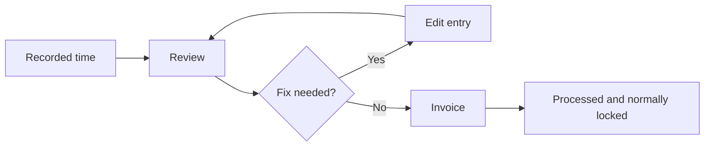

# Review time before billing

A good Kimai billing workflow has a deliberate boundary between **recorded time** and **processed time**.

Before crossing that boundary, review the entries that you expect to bill.

## Why review first

Creating an invoice does more than generate a document.  Kimai's invoice and export functions share the export flag.  Processed time is excluded by default from later invoices and regular users can no longer edit it.

That means a wrong activity, duration, description, billable flag, or stored price is easier to correct before invoicing than afterward.

## Start from the timesheet view

Use **My times** to inspect the period you intend to bill.  Kimai's timesheet search can filter by date range, customer, project, activity, tags, and running/stopped state.  In a team context, authorized users can also work with other users' records.

For a monthly invoice to Acme Manufacturing, for example, a useful review scope is:

- the intended billing date range;
- Acme Manufacturing;
- the relevant project or projects;
- stopped records only.

The goal is to make the review set look as much as possible like the set you expect the invoice to contain.

## Review classification first

For each entry, ask:

- Is this the correct customer through the selected project?
- Is the project the correct engagement?
- Is the activity the right category of work?
- Does the description make sense to someone reading it later?
- Are any tags intentional and useful?

Classification errors can distort both invoices and reporting even when the number of hours is correct.

## Review time and price

Check the duration against whatever source you consider authoritative for the work performed.

If rate information is visible to your role, also check the calculated price.  Kimai stores the price with each timesheet record rather than continuously recalculating it from today's customer/project/activity rates.  That is useful for historical stability, but it also means that a rate configured incorrectly yesterday may already be embedded in yesterday's entries.

If a stored price is wrong, investigate the applicable rate rule before creating more records with the same problem.

## Review billability

Only billable time is included in invoices.

Automatic billability depends on the customer, project, and activity all being marked billable.  If an entry you expected to invoice is missing later, its billable state is one of the first things to check.

Likewise, an internal or courtesy entry that should not reach the client should be non-billable before the invoice is created.

## A useful pre-invoice checklist

For the set of time you intend to bill, verify:

- no timer is accidentally still running;
- dates and durations are correct;
- customer/project/activity classifications are correct;
- descriptions contain whatever level of detail you want preserved;
- expected entries are billable;
- intentionally non-billable work is not billable;
- stored prices look correct;
- the date range contains neither missing work nor work from the wrong billing period.

This is not accounting advice.  It is a Kimai data-quality checkpoint before records become processed history.

## What if an entry is already processed?

Processed entries are normally locked.  Kimai has an `edit_exported_timesheet` permission that allows authorized administrators to edit or delete exported entries, but using that permission does not erase the accounting implications of an invoice that may already exist.

If the problem involves an already-created invoice, read [Create and manage invoices](create-invoice.md) before changing historical records.

## Next

When the review set is correct, continue to [create and manage invoices](create-invoice.md).

## Official reference

See Kimai's [Timesheet](https://www.kimai.org/documentation/timesheet.html), [Billable](https://www.kimai.org/documentation/billable.html), and [Invoices](https://www.kimai.org/documentation/invoices.html) documentation.
